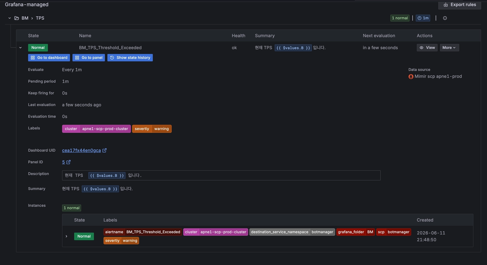
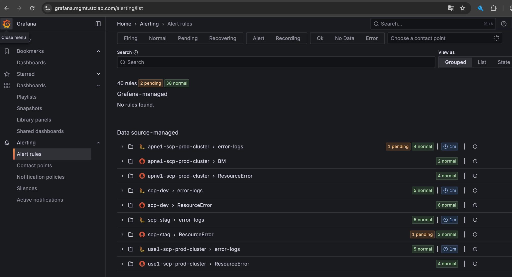

# Grafana 수동 알림 룰을 GitOps 기반 Mimir ruler rule로 이전

## 1. 작업 배경

Grafana UI에 `BM_TPS_Threshold_Exceeded` 알림 룰이 수동으로 등록되어 있었다.

이 룰은 Grafana 화면에서는 확인할 수 있었지만, Git repository에는 설정이 남아 있지 않은 **Grafana-managed rule**이었다.

수동으로 관리되는 알림 룰은 다음 문제가 있다.

* 누가 언제 수정했는지 Git 이력으로 추적하기 어려움
* PR 리뷰를 거치지 않음
* 운영 설정과 코드 사이에 drift가 생길 수 있음
* label 오타 같은 설정 실수가 반복될 수 있음

기존 룰에는 알림 중요도를 나타내는 label key에 오타가 있었다.

```yaml
severtiy: warning
```

원래 의도한 label은 다음과 같다.

```yaml
severity: warning
```

이번 작업은 단순히 Grafana UI에서 오타를 한 번 고치는 것이 아니라, 알림 룰 자체를 코드로 관리되도록 옮겨서 같은 문제가 반복되지 않게 하는 것이 목적이었다.

---

## 2. Before: Grafana-managed rule

기존 `BM_TPS_Threshold_Exceeded` 룰은 Grafana UI에서 직접 생성된 수동 룰이었다.

즉, Grafana가 이 룰의 소유자였다.

```text
Grafana UI
└── Grafana-managed rule
    └── BM_TPS_Threshold_Exceeded
```

### 기존 Grafana 수동 룰 화면

<!-- 이미지 1 첨부 위치 -->

<!-- 기존 Grafana-managed > BM > TPS > BM_TPS_Threshold_Exceeded 상세 화면 -->



---

## 3. After: Data source-managed rule

변경 후에는 기존 Grafana 수동 룰을 삭제하고, 동일한 알림을 Mimir ruler rule로 코드화했다.

이제 Grafana는 룰을 직접 소유하지 않고, Mimir datasource에 등록된 rule을 보여주는 역할을 한다.

```text
Mimir
└── ruler rule
    └── BM_TPS_Threshold_Exceeded

Grafana
└── Data source-managed rule로 조회
```

즉, Grafana에서 보이긴 하지만 실제 관리 주체는 Grafana가 아니라 Mimir이다.

---

## 4. 현재 Observability 구조를 이해하는 기준

이번 흐름을 이해하려면 각 도구의 역할을 분리해서 봐야 한다.

| 컴포넌트             | 역할                                     |
| ---------------- | -------------------------------------- |
| Git / PR         | 알림 룰 설정의 source of truth               |
| ArgoCD           | Git에 있는 설정을 Kubernetes 클러스터에 동기화       |
| CronJob          | 클러스터에 반영된 ruler rule 설정을 Mimir에 등록     |
| Mimir            | Prometheus 계열 메트릭 저장소 + alert rule 백엔드 |
| Ruler            | Mimir에 등록된 alert rule을 주기적으로 평가        |
| Grafana          | 대시보드와 alert rule 상태를 확인하는 UI           |
| Robusta Playbook | alert 발생 후 자동으로 실행되는 대응 액션 묶음          |

핵심은 다음이다.

```text
Git이 설정의 기준이고,
ArgoCD가 Git의 상태를 클러스터로 가져오고,
CronJob이 그 설정을 Mimir에 등록하고,
Mimir ruler가 알림 조건을 평가하고,
Grafana는 그 상태를 보여주고,
Robusta가 알림 발생 후 액션을 수행한다.
```

---

## 5. Mimir란?

Mimir는 Prometheus 계열의 메트릭 저장소이다.

애플리케이션, Kubernetes, Istio 등에서 발생한 메트릭을 저장하고, PromQL로 조회할 수 있다.

예를 들어 이번 알림 룰에서는 Istio request metric을 사용한다.

```text
istio_requests_total
```

이 메트릭은 HTTP 요청 수를 나타내는 누적 카운터이고, Mimir에 저장된다.

Mimir는 단순 저장소 역할만 하는 것이 아니라, alert rule도 관리할 수 있다.
그래서 Grafana가 직접 알림을 평가하지 않고, Mimir 쪽에 rule을 등록해서 평가하게 만들 수 있다.

---

## 6. Ruler란?

Ruler는 Mimir에 등록된 alert rule을 주기적으로 평가하는 컴포넌트이다.

예를 들어 다음과 같은 rule이 있다고 하면:

```text
botmanager 요청량이 기준치를 넘으면 alert 발생
```

Ruler는 이 조건을 주기적으로 실행한다.

역할은 다음과 같다.

* PromQL 조건 실행
* 조건 만족 여부 판단
* normal / pending / firing 상태 관리
* 조건이 유지되면 alert 발생

이번 룰에서는 `for: 1m` 조건이 있기 때문에, 임계값 초과 상태가 1분 동안 유지될 때 alert가 발생한다.

---

## 7. ArgoCD란?

ArgoCD는 Git에 있는 설정을 Kubernetes 클러스터에 반영하는 GitOps 도구이다.

여기서 중요한 점은 사람이 직접 클러스터 설정을 바꾸는 것이 아니라, Git에 올라간 설정이 기준이 된다는 것이다.

```text
Git repository
→ ArgoCD sync
→ Kubernetes cluster
```

즉, 알림 룰을 추가하거나 수정할 때도 UI에서 직접 바꾸는 것이 아니라 Git에 YAML로 작성하고 PR을 통해 반영한다.

이렇게 하면 다음 장점이 있다.

* 변경 이력 추적 가능
* PR 리뷰 가능
* 누가 어떤 설정을 바꿨는지 확인 가능
* 운영 설정과 코드 사이 drift 감소

---

## 8. CronJob은 왜 필요한가?

ArgoCD는 Git의 설정을 Kubernetes 클러스터에 동기화한다.

하지만 Mimir의 ruler rule은 최종적으로 Mimir에 등록되어야 한다.

그래서 중간에 CronJob이 있다.

CronJob의 역할은 다음과 같다.

```text
Kubernetes에 반영된 ruler rule 설정을 읽음
→ Mimir API에 rule 등록
```

즉, ArgoCD가 Git의 설정을 클러스터에 반영하고, CronJob이 그 설정을 Mimir 쪽으로 동기화하는 구조이다.

그래서 전체 흐름에 `ArgoCD sync`와 `CronJob`이 둘 다 등장한다.

---

## 9. Grafana의 역할

Grafana는 메트릭과 알림 상태를 확인하는 UI 역할을 한다.

중요한 점은 Grafana에 보이는 rule이 항상 Grafana가 관리하는 rule은 아니라는 것이다.

Grafana Alert rules 화면에는 크게 두 종류가 있다.

| 구분                       | 의미                                             |
| ------------------------ | ---------------------------------------------- |
| Grafana-managed rule     | Grafana UI에서 직접 생성하고 Grafana가 관리하는 rule        |
| Data source-managed rule | Mimir 같은 datasource에 등록된 rule을 Grafana가 보여주는 것 |

이번 작업 전에는 `BM_TPS_Threshold_Exceeded`가 Grafana-managed rule이었다.

변경 후에는 Mimir ruler rule로 등록되기 때문에 Grafana에서는 Data source-managed rule로 확인된다.

---

## 10. Robusta Playbook이란?

Robusta Playbook은 alert가 발생했을 때 자동으로 실행되는 행동 묶음이다.

Alert가 발생하면 단순히 “알림 발생”만 보내는 것이 아니라, 운영자가 바로 확인할 수 있도록 여러 후속 액션을 자동으로 붙일 수 있다.

예를 들면 다음과 같다.

* 담당자 멘션
* 관련 대시보드 링크 추가
* 자동 조사 액션 실행
* Slack 알림 메시지 보강

즉, Mimir ruler가 alert를 발생시키면, Robusta Playbook이 그 alert를 받아서 실제 대응 가능한 형태로 가공한다.

---

## 11. 실제 반영 흐름

이번 작업은 다음 흐름으로 반영된다.

```text
1. Mimir ruler rule YAML 수정
2. git commit
3. git push
4. PR 생성 및 merge
5. ArgoCD가 Git 변경사항 감지
6. ArgoCD sync로 Kubernetes에 설정 반영
7. CronJob이 ruler rule 설정을 읽음
8. CronJob이 Mimir에 alert rule 등록
9. Mimir ruler가 rule을 주기적으로 평가
10. 조건 만족 시 alert 발생
11. Robusta Playbook이 후속 액션 실행
12. Grafana에서 Data source-managed rule로 확인
```

간단히 줄이면 다음과 같다.

```text
Git
→ ArgoCD
→ Kubernetes
→ CronJob
→ Mimir
→ Ruler
→ Robusta
→ Grafana에서 확인
```

---

## 12. 내가 수정한 내용

수정한 파일은 다음이다.

```text
apps/observability/ruler-rules/mimir/apne1-scp-prod-cluster.yaml
```

기존 파일에는 `ResourceError` group이 있었고, 그 안에 CPU, Pod restart, PVC 사용량 같은 리소스 계열 알림들이 들어가 있었다.

```yaml
namespace: apne1-scp-prod-cluster
groups:
- name: ResourceError
  rules:
  - alert: ContainerCPUAlert
  - alert: BMContainerCPUHigh
  - alert: PodRestartAlert
  - alert: PVCUsageAlert
  - alert: ContainerErrorTerminatedAlert
```

`BM_TPS_Threshold_Exceeded`는 리소스 에러 알림이 아니라 TPS 기준 알림이기 때문에, 기존 `ResourceError` group 안에 넣지 않고 별도의 `TPS` group으로 분리했다.

```yaml
- name: TPS
  rules:
  - alert: BM_TPS_Threshold_Exceeded
```

추가한 label은 다음과 같다.

```yaml
labels:
  cluster: apne1-scp-prod-cluster
  severity: warning
  source: mimir
```

각 label의 의미는 다음과 같다.

| Label      | 값                        | 의미                      |
| ---------- | ------------------------ | ----------------------- |
| `cluster`  | `apne1-scp-prod-cluster` | 알림이 발생한 클러스터            |
| `severity` | `warning`                | 알림 중요도                  |
| `source`   | `mimir`                  | Mimir ruler에서 관리되는 rule |

---

## 13. 왜 오타가 없어지는가?

기존 Grafana 수동 룰에는 다음과 같은 오타가 있었다.

```text
severtiy = warning
```

이번 작업에서는 이 룰을 Grafana UI에서 직접 수정한 것이 아니다.

오타가 있던 Grafana-managed 수동 룰을 삭제하고, 같은 역할을 하는 Mimir ruler rule을 코드로 새로 정의했다.

새로 정의한 rule에서는 올바른 label key를 사용했다.

```text
severity = warning
```

따라서 구조는 다음처럼 바뀐다.

```text
기존:
Grafana-managed rule
severtiy = warning

변경 후:
Mimir ruler rule
severity = warning
```

즉, 오타가 자동으로 고쳐지는 것이 아니라, 오타가 있던 수동 룰을 제거하고 올바른 label을 가진 코드 기반 rule로 대체한 것이다.

---

## 14. 변경 후 확인

기존 Grafana-managed 수동 룰은 삭제했다.

변경 후에는 Grafana-managed 영역에 해당 룰이 없고, Mimir datasource 기반의 Data source-managed rule로 확인된다.

### 변경 후 Grafana 화면

<!-- 이미지 2 첨부 위치 -->

<!-- Grafana-managed에는 No rules found, Data source-managed 아래 rule group이 보이는 화면 -->



---

## 15. 정리

이번 작업은 Grafana UI에 수동으로 있던 `BM_TPS_Threshold_Exceeded` 알림 룰을 삭제하고, 동일한 알림을 Mimir ruler rule로 코드화한 작업이다.

핵심은 label 오타를 UI에서 한 번 수정한 것이 아니라, 알림 룰 관리 방식을 수동 UI 관리에서 GitOps 기반 코드 관리로 옮긴 것이다.

이제 알림 룰은 다음 흐름으로 관리된다.

```text
Git / PR
→ ArgoCD
→ CronJob
→ Mimir
→ Ruler
→ Robusta
→ Grafana에서 확인
```

이를 통해 알림 룰 변경 이력을 남길 수 있고, PR 리뷰를 통해 label 오타 같은 설정 실수를 줄일 수 있다.
