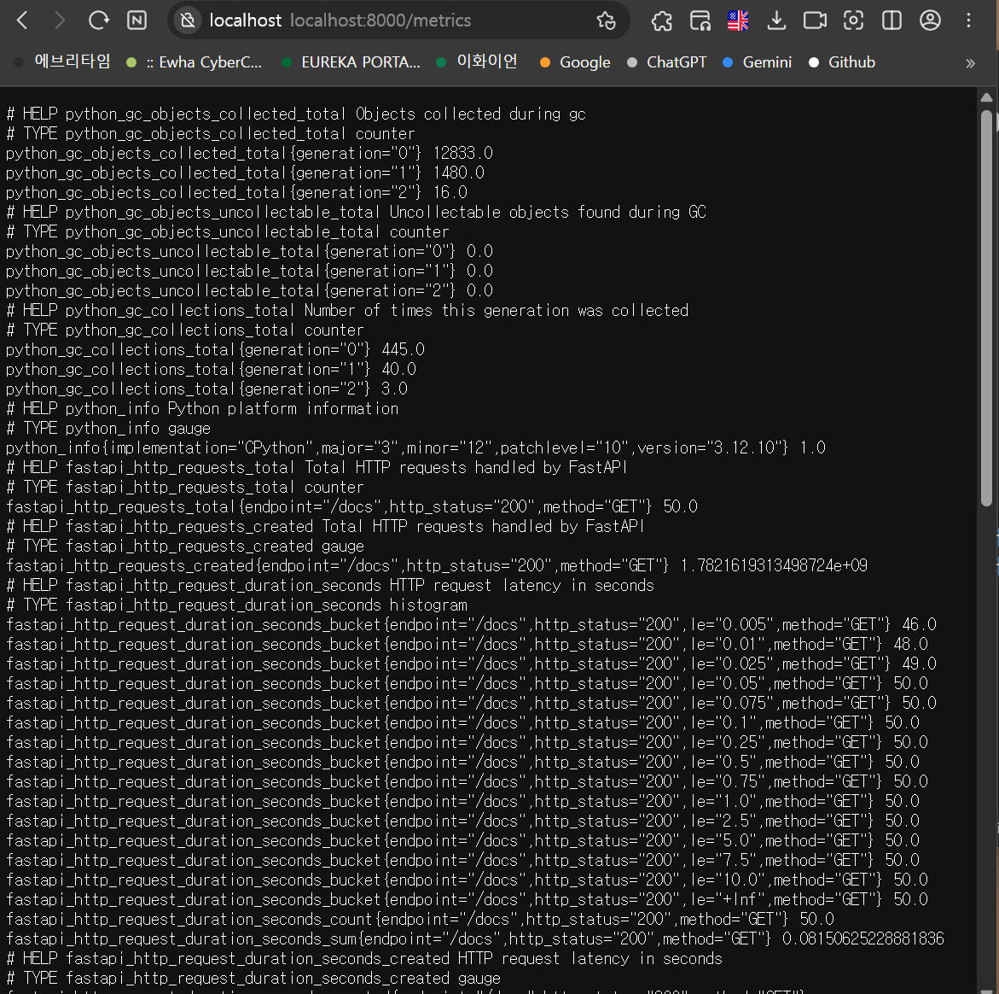

# Week 8 정리 - handDoc 옵저버빌리티 장애 시뮬레이션 실습

이미지는 노션 첨부 링크 참고해주시면 감사하겠습니다. 
https://app.notion.com/p/6-21-38650b8ae11e80cfbcc0e0b5a1f4d7d2?source=copy_link


## 1. 이번 주에 해본 것

이번 주에는 handDoc 프로젝트에 Prometheus와 Grafana 기반의 모니터링 환경을 구성한 뒤, 실제로 장애를 발생시켜 각 서비스의 상태 변화가 어떻게 관측되는지 확인했다. 단순히 메트릭 endpoint를 연결하는 것에서 끝내지 않고, Spring Boot 서버 장애, FastAPI 서버 장애, MySQL 의존성 장애를 직접 만들어 Prometheus Target 상태와 Grafana 대시보드, Spring Actuator health 결과가 어떻게 달라지는지 관찰했다.

먼저 정상 상태를 기준으로 Prometheus Targets 화면에서 `prometheus`, `spring-boot`, `fastapi` job이 모두 `UP`인 것을 확인했다. 이 상태를 장애 발생 전 기준 상태로 두고, Grafana 대시보드에서도 각 서비스의 `up` 값이 1로 표시되는지 확인했다.

[Prometheus Targets 정상 상태 - prometheus/spring-boot/fastapi 모두 UP]



첫 번째로 FastAPI 서버 장애를 시뮬레이션했다. FastAPI 서버를 실행 중이던 터미널에서 `Ctrl + C`로 서버를 중단하자, Prometheus Targets 화면에서 `fastapi` job이 `DOWN`으로 바뀌었다. Grafana 대시보드에서도 `up{job="fastapi"}` 값이 1에서 0으로 떨어지는 것을 확인했다. 이를 통해 AI 서버가 중단되면 Prometheus가 scrape 실패를 감지하고, Grafana에서 서비스 비정상 상태를 시각적으로 확인할 수 있음을 확인했다.

[FastAPI 중단 후 Prometheus Targets에서 fastapi DOWN]


[Grafana에서 fastapi up 값이 0으로 떨어진 화면]


두 번째로 Spring Boot 서버 장애를 시뮬레이션했다. Spring Boot를 실행 중이던 `bootRun` 터미널에서 `Ctrl + C`로 서버를 중단하자, Prometheus Targets 화면에서 `spring-boot` job이 `DOWN`으로 바뀌었다. Spring Boot의 `/actuator/prometheus` endpoint에 Prometheus가 접근하지 못하게 되면서 scrape 실패가 발생했고, Grafana에서도 `up{job="spring-boot"}` 값이 0으로 떨어졌다.

[Spring Boot 중단 후 Prometheus Targets에서 spring-boot DOWN]


[Grafana에서 spring-boot up 값이 0으로 떨어진 화면]


세 번째로 MySQL 의존성 장애를 시뮬레이션했다. 이 경우에는 Spring Boot 서버 자체는 종료하지 않고, Docker에서 MySQL 컨테이너만 중단했다.

```bash
docker stop handdoc-mysql
```

이후 `/actuator/health`를 확인하자 전체 상태가 `DOWN`으로 바뀌었고, component 중 `db`만 `DOWN`으로 표시되었다. 세부 오류로는 `Failed to obtain JDBC Connection`이 나타났다. 반면 `mongo`, `diskSpace`, `ping` 등 다른 component는 `UP` 상태를 유지했다.


이 실험에서 중요한 점은 Spring Boot 프로세스 자체가 살아있더라도 DB 의존성이 죽으면 서비스 health는 `DOWN`이 될 수 있다는 것이다. 즉, Prometheus의 `up` metric은 “해당 endpoint가 scrape 가능한가”를 보여주는 지표이고, 실제 서비스가 정상 동작하는지는 `/actuator/health` 같은 내부 상태 지표와 함께 봐야 한다는 것을 확인했다.

마지막으로 MySQL 컨테이너를 다시 실행해 장애 복구도 확인했다.

```bash
docker start handdoc-mysql
```

이후 Spring Boot health 상태가 다시 `UP`으로 돌아오는 것을 확인했고, 이를 통해 장애 발생 → 관측 → 복구 흐름을 한 번에 실습할 수 있었다.

---

## 2. 새로 알게 된 점

이번 실습을 통해 Prometheus의 `up` metric이 의미하는 바를 더 정확히 알게 되었다. 처음에는 `up` 값이 1이면 서비스가 완전히 정상이라고 생각했지만, 실제로는 Prometheus가 해당 target의 metrics endpoint를 scrape할 수 있다는 의미에 가깝다. 즉, `up{job="spring-boot"}`가 1이어도 내부 DB 연결이 실패하면 실제 서비스 health는 `DOWN`일 수 있다.

FastAPI와 Spring Boot 서버를 직접 중단했을 때는 Prometheus Targets 화면에서 해당 job이 바로 `DOWN`으로 바뀌었다. 이 경우는 애플리케이션 프로세스 자체가 죽은 장애이기 때문에 `up` metric으로도 쉽게 감지할 수 있었다.

반면 MySQL 장애는 조금 달랐다. Spring Boot 서버는 계속 실행 중이었지만, DB 연결을 담당하는 component가 실패하면서 `/actuator/health`의 전체 상태가 `DOWN`이 되었다. 이를 통해 장애에는 서버 프로세스 중단처럼 겉으로 바로 보이는 장애도 있고, DB나 외부 API처럼 내부 의존성에서 발생하는 장애도 있다는 것을 알게 되었다.

또한 Grafana 대시보드는 단순히 예쁜 시각화 도구가 아니라, 장애 전후의 상태 변화를 시간 흐름으로 확인할 수 있게 해주는 도구라는 점을 체감했다. 정상 상태에서는 `up` 값이 1로 유지되다가, 서버를 중단하면 0으로 떨어지고, 다시 복구하면 1로 돌아오는 흐름을 그래프로 확인할 수 있었다.

이번 실습을 통해 “관측 가능성”은 단순히 메트릭을 수집하는 것이 아니라, 장애가 발생했을 때 어디가 죽었는지, 프로세스가 죽은 것인지, 내부 의존성이 죽은 것인지 구분할 수 있게 만드는 것이라는 점을 알게 되었다.

---

## 3. 막힌 부분이나 같이 보고 싶은 질문

장애 시뮬레이션 과정에서 가장 헷갈렸던 부분은 MySQL 장애를 언제 발생시켜야 하는지였다. 처음에는 MySQL 컨테이너가 꺼진 상태에서 Spring Boot를 다시 실행했는데, 이 경우 Spring Boot가 부팅 과정에서 DB 연결에 실패해 아예 애플리케이션이 시작되지 않았다. 이후 MySQL을 다시 켠 뒤 Spring Boot를 정상 실행하고, 그 상태에서 MySQL 컨테이너만 중단하자 `/actuator/health`에서 DB component가 `DOWN`으로 바뀌는 것을 확인할 수 있었다.

이를 통해 “앱 시작 시점에 DB가 없는 경우”와 “운영 중에 DB가 죽는 경우”가 다르게 나타날 수 있다는 점을 알게 되었다. 시작 시점에 DB가 없으면 Spring Boot 자체가 부팅 실패할 수 있고, 운영 중에 DB가 죽으면 프로세스는 살아있지만 health 상태가 DOWN이 될 수 있다.

또 하나 막힌 부분은 `/actuator/health` 접속이 바로 되지 않거나 느리게 뜨는 경우였다. MySQL을 중단한 뒤 health endpoint가 DB 연결 확인을 시도하면서 응답이 지연될 수 있었다. 하지만 결과적으로 health 응답에서 `db` component가 `DOWN`으로 표시되어 장애 증거를 확보할 수 있었다.

같이 더 보고 싶은 질문은 다음과 같다.

- Prometheus에서 Spring Boot의 health status 자체를 metric으로 더 명확하게 수집하려면 어떤 설정이 필요한가?
- `up` metric과 `/actuator/health` 결과를 Grafana에서 함께 보여주려면 어떤 패널 구성이 좋은가?
- DB 장애처럼 프로세스는 살아있지만 내부 의존성이 죽은 상황을 alert로 잡으려면 어떤 PromQL rule을 써야 하는가?
- FastAPI WebSocket 서버의 경우 단순 `/metrics` scrape 성공 외에 실제 AI 추론 실패를 어떻게 alert 조건으로 만들 수 있는가?
- 장애 발생 후 복구까지 걸린 시간을 측정하려면 어떤 메트릭을 추가하면 좋은가?

---

## 4. 다음에 이어서 해볼 것

다음에는 이번에 확인한 장애 시뮬레이션을 기반으로 Alert 설정까지 이어서 해보고 싶다. 현재는 Prometheus Targets와 Grafana 대시보드를 사람이 직접 확인해야 장애를 알 수 있다. 다음 단계에서는 `spring-boot`나 `fastapi` job이 `DOWN`이 되었을 때, 또는 DB health가 `DOWN`이 되었을 때 자동으로 알림이 발생하도록 Grafana Alert나 Alertmanager를 설정해보고 싶다.

또한 지금은 장애 발생 여부를 중심으로 확인했지만, 다음에는 장애 발생 전후의 응답 시간 변화도 더 자세히 보고 싶다. 예를 들어 FastAPI AI 서버에 프레임 요청을 많이 보냈을 때 `ai_sign_inference_duration_seconds`가 어떻게 변하는지, Spring Boot 요청 수와 응답 시간이 트래픽 증가에 따라 어떻게 바뀌는지 확인해볼 수 있다.

MySQL 장애 실험도 더 확장해보고 싶다. 이번에는 단순히 컨테이너를 중단해서 DB 연결 실패를 만들었지만, 다음에는 DB 응답 지연, connection pool 고갈, connection timeout 같은 상황도 만들어보고 싶다. 이 경우 HikariCP metric을 통해 active connection, idle connection, pending connection이 어떻게 변하는지 확인할 수 있을 것 같다.

마지막으로 로그 관측도 추가해보고 싶다. 이번 실습에서는 Prometheus/Grafana로 metric 중심의 관측을 진행했지만, 장애 원인을 더 구체적으로 파악하려면 Spring Boot와 FastAPI 로그를 함께 보는 것이 필요하다. 다음에는 Loki 또는 Promtail을 붙여서 Grafana에서 metric과 log를 함께 확인하는 구조로 확장해보고 싶다.
