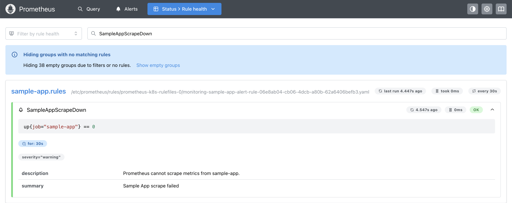
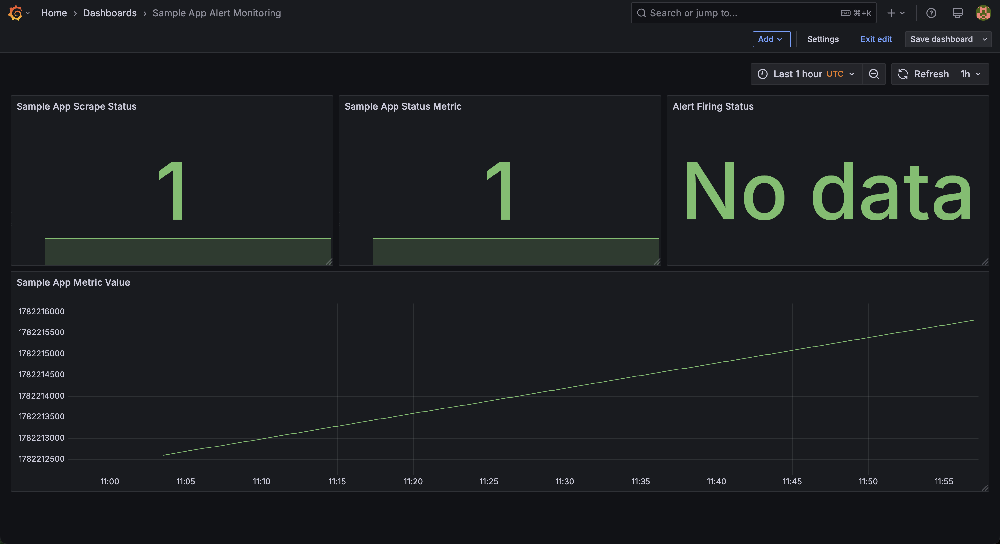
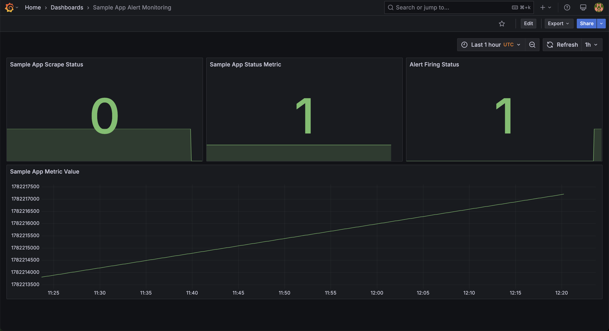
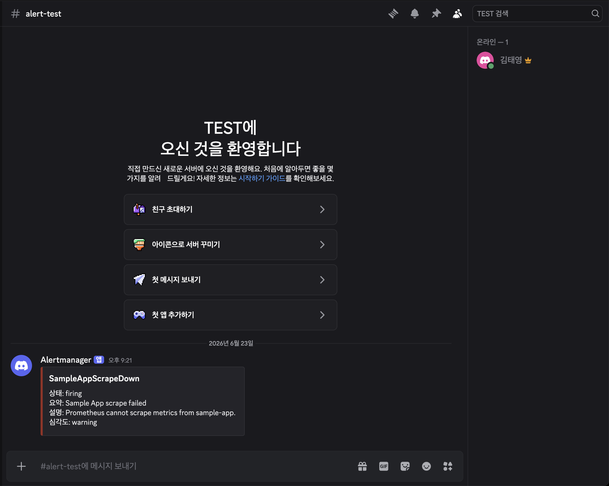
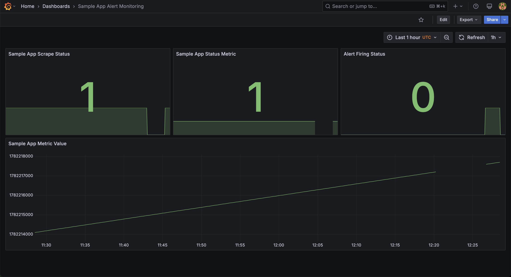
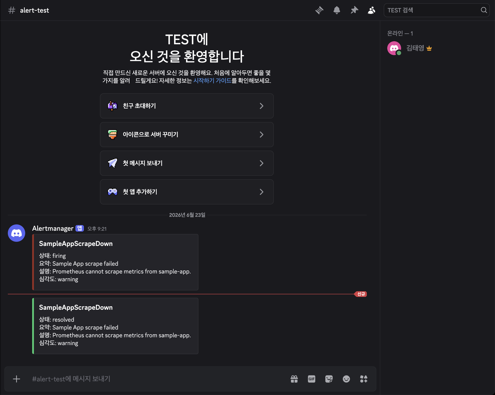

### 실습 배경

---

지난 실습에서는 Prometheus Operator와 kube-prometheus를 구성하고, `ServiceMonitor`를 통해 `sample-app`의 `/metrics` 엔드포인트를 Prometheus가 정상적으로 수집하는 과정을 확인했음

이번 실습에서는 크게 두가지를 목표로 수행

1. 기존 메트릭 수집 구조를 확장하여 Prometheus가 수집 실패 상황을 감지하고, Alertmanager를 통해 Discord Webhook으로 alert를 전달하는 과정을 확인
2. Grafana Dashboard를 구성하여 장애 발생 전후의 메트릭 변화와 alert 상태를 시각적으로 확인

### 실습 흐름

---

1. AlertManager 및 Grafana 포트포워딩 및 접속

```jsx
kubectl -n monitoring port-forward svc/alertmanager-main 9093

kubectl -n monitoring port-forward svc/grafana 3000
```

2. PrometheusRule 작성 및 적용
- sample-app-alert-rule.yaml
    - `sample-app` scrape가 실패하면 alert가 발생하도록 만드는 파일

```jsx
apiVersion: monitoring.coreos.com/v1
kind: PrometheusRule
metadata:
  name: sample-app-alert-rule
  namespace: monitoring
  labels:
    prometheus: k8s
    role: alert-rules
spec:
  groups:
  - name: sample-app.rules
    rules:
    - alert: SampleAppScrapeDown
      expr: up{job="sample-app"} == 0
      for: 30s
      labels:
        severity: warning
      annotations:
        summary: "Sample App scrape failed"
        description: "Prometheus cannot scrape metrics from sample-app."
```



3. 그라파나 대시보드 구성



| 패널 이름 | PromQL | 목적 |
| --- | --- | --- |
| Sample App Scrape Status | `up{job="sample-app"}` | Prometheus가 sample-app을 정상적으로 scrape하고 있는지 |
| Sample App Status Metric | `sample_app_up` | sample-app이 직접 노출한 상태 메트릭 |
| Sample App Metric Value | `sample_app_requests_total` | sample-app에서 만든 counter 형태의 테스트 메트릭 |
| Alert Firing Status | `max(ALERTS{alertname="SampleAppScrapeDown", alertstate="firing"}) or vector(0)` | PrometheusRule에 의해 `SampleAppScrapeDown` alert가 firing 상태인지 확인한다. 정상 상태에서는 0, 장애 발생 시에는 1로 표시됨 |
4. 디스코드 웹훅 설정
- alertmanager.yaml

```jsx
global:
  resolve_timeout: 5m

route:
  receiver: "null"
  group_by: ["alertname", "job"]
  group_wait: 10s
  group_interval: 30s
  repeat_interval: 3h
  routes:
  - receiver: "discord"
    matchers:
    - alertname="SampleAppScrapeDown"

receivers:
- name: "null"

- name: "discord"
  discord_configs:
  - webhook_url: "$DISCORD_WEBHOOK_URL"
    send_resolved: true
    title: "{{ .CommonLabels.alertname }}"
    message: |
      {{ range .Alerts }}
      상태: {{ .Status }}
      요약: {{ .Annotations.summary }}
      설명: {{ .Annotations.description }}
      심각도: {{ .Labels.severity }}
      {{ end }}
```

- Alertmanager Secret에 적용

```jsx
kubectl -n monitoring create secret generic alertmanager-main \
  --from-file=alertmanager.yaml=alertmanager.yaml \
  --dry-run=client -o yaml | kubectl apply -f -
```

5. 장애 유발

```jsx
kubectl patch servicemonitor sample-app \
  --type='merge' \
  -p '{"spec":{"endpoints":[{"port":"http","path":"/wrong-metrics","interval":"15s"}]}}'
```

6. 장애 상황 확인



<aside>

장애 상황에서는 ServiceMonitor의 metrics path가 잘못 설정되어 Prometheus의 scrape가 실패하므로 `up{job="sample-app"}` 값은 0으로 변경된다. 반면 `sample_app_up`은 애플리케이션이 직접 노출하는 메트릭으로, scrape 실패 직전의 값이 대시보드에 남아 보일 수 있다. 따라서 본 실습의 장애 판단 기준은 Prometheus의 scrape 성공 여부를 나타내는 `up` 메트릭으로 설정

</aside>



7. 장애 복구

```jsx
kubectl patch servicemonitor sample-app \
  --type='merge' \
  -p '{"spec":{"endpoints":[{"port":"http","path":"/metrics","interval":"15s"}]}}'
```

8. 복구 확인






---

### 결론

<aside>

이번 실습에서는 지난 실습에서 구성한 ServiceMonitor 기반 메트릭 수집 구조를 확장하여, PrometheusRule을 이용한 장애 조건 정의와 Alertmanager를 통한 외부 알림 전송 과정을 확인하였다. ServiceMonitor의 metrics path를 의도적으로 잘못 설정하여 scrape 실패 상황을 만들었고, Prometheus의 up 메트릭이 0으로 변경되면서 SampleAppScrapeDown alert가 firing 상태로 전환되는 것을 확인하였다.

또한 Alertmanager의 Discord Webhook receiver를 구성하여 alert 발생 시 Discord 채널로 알림이 전송되도록 하였으며, 복구 이후 resolved 알림까지 수신되는 것을 확인하였다. Grafana Dashboard에서는 scrape 상태, sample-app 상태 메트릭, 테스트 counter, alert firing 상태를 시각화하여 장애 발생 전후의 변화를 한눈에 확인할 수 있었다.

이를 통해 Kubernetes 환경에서 Prometheus Operator 기반 모니터링이 단순한 메트릭 수집을 넘어 장애 감지, 외부 알림, 시각화, 복구 확인까지 이어지는 운영 대응 흐름으로 확장될 수 있음을 확인하였다.

</aside>